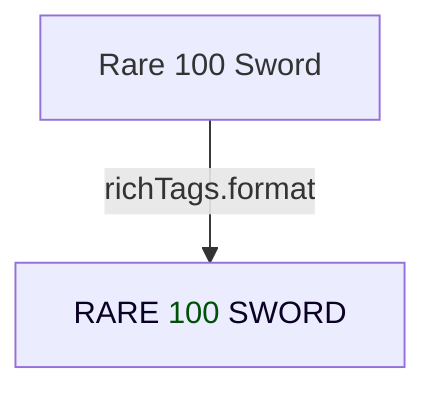

# richTags

A lightweight, extensible **RichText tag formatter** for Roblox.  
Turn easy-to-read placeholder tags like `<rare>`, `<damage>`, or even standard `<b>`/`<i>` into full Roblox **RichText** markup – complete with colors, strokes, uppercase text, and more.



---

## ✨ Features

• Human-readable placeholder tags → valid RichText.  
• Supports unlimited **nesting** & mixed built-in tags (`<b>`, `<u>`, etc.).  
• **Dynamic helper functions** (`richTags.rare("text")`).  
• **Auto-formats** every `TextLabel` tagged `"formatText"` via `CollectionService`.  
• Easily **extend** or override tags in one file (`tags.luau`).  
• Graceful handling of malformed or circular tag definitions.

---

## 📥 Installation

1. Copy `src/client/ui/modules/richTags` into your game, or install via your favourite package manager (e.g. [Wally](https://wally.run)):  
   ```toml
   [dependencies]
   rich-tags = "github:"
   ```
2. `require` the module where you need it:
   ```lua
   local richTags = require(path.to.richTags)
   ```

### Optional: Automatic TextLabel formatting
Tag any `TextLabel` with `CollectionService:AddTag(label, "formatText")` and the module will:  
• save the original text in an `OriginalText` attribute,  
• enable `RichText`,  
• replace the text with the formatted version.

---

## 🚀 Quick Start

```lua
local richTags = require(path.to.richTags)

local text = "<rare>Found <legendary>Golden Sword</legendary> with <damage>150</damage>!</rare>"
local formatted = richTags.format(text)
print(formatted) -- Ready to assign to TextLabel.Text
```

Or, use the generated helper:
```lua
textLabel.Text = richTags.legendary("Golden Drop!")
```

---

## 📚 API Reference

### `richTags.format(templateString: string): string`
Parses `templateString`, replaces every `<tag>...</tag>` with its RichText equivalent (recursively), and returns the result.

```lua
local out = richTags.format("<epic><b>Epic Loot</b></epic>")
-- "<font color='rgb(159, 111, 255)'><stroke⋯><uppercase><b>EPIC LOOT</b></uppercase></stroke></font>"
```

---

### `richTags.wrap(tagName: string, content: string): string`
Directly wrap `content` in the RichText for `tagName` (no parsing / nesting).

```lua
local damageText = richTags.wrap("damage", "75")
-- "<font color='rgb(255, 70, 70)'>75</font>"
```

---

### `richTags.getRawTag(tagName: string): { open: string, close: string }?`
Returns the underlying `open` and `close` strings for a tag, or `nil` if unknown.

```lua
local tag = richTags.getRawTag("rare")
-- tag.open  == "<font color='rgb(33, 159, 255)'><stroke⋯><uppercase>"
-- tag.close == "</uppercase></stroke></font>"
```

---

### Dynamic Tag Helpers
Every tag becomes a function: `richTags[tagName](content)` → same as `wrap`.

```lua
local msg = richTags.rare("Blue Item")
```

---

## 🎨 Built-in Tags

| Category  | Tag               | Preview* |
|-----------|-------------------|---------|
| Rarity    | `<secret>` `<mythic>` `<legendary>` `<epic>` `<rare>` |  |
| Attribute | `<damage>` `<critChance>` | |
| RichText  | `<b>` `<i>` `<u>` `<s>` `<sub>` `<sup>` `<small>` `<br/>` |
| TextCase  | `<uppercase>`/`<uc>` `<smallcaps>`/`<sc>` | |

\*Preview requires a TextLabel with `RichText` enabled.

---

## 🛠 Extending / Customising Tags

Edit `src/client/ui/modules/richTags/tags.luau`:

```lua
return {
    -- Existing …

    shiny = {
        open  = '<font color="rgb(0, 255, 0)">',
        close = '</font>'
    },

    -- Reference another custom tag
    enhanced = { open = '<rare>', close = '</rare>' },
}
```
Just **reload** the module and the new tag will automatically get a helper (`richTags.shiny`).

---

## ⚠️ Edge Cases & Limits

• Numeric tag names like `<123>` are rejected.  
• Tags must be properly nested (`<a><b>text</b></a>`).  
• Max **100 iterations** guard against infinite recursion.  
• Original unformatted text stored in the `OriginalText` attribute.  
• Very deep or malformed HTML may behave unexpectedly.

---

## 🧪 Running the Demo

A simple test runner lives at `src/client/ui/modules/richTags/test.client.lua`.  
Play-test to cycle through >60 example strings and see formatting live.

---

## 📄 License

MIT – see [`LICENSE`](LICENSE). 
